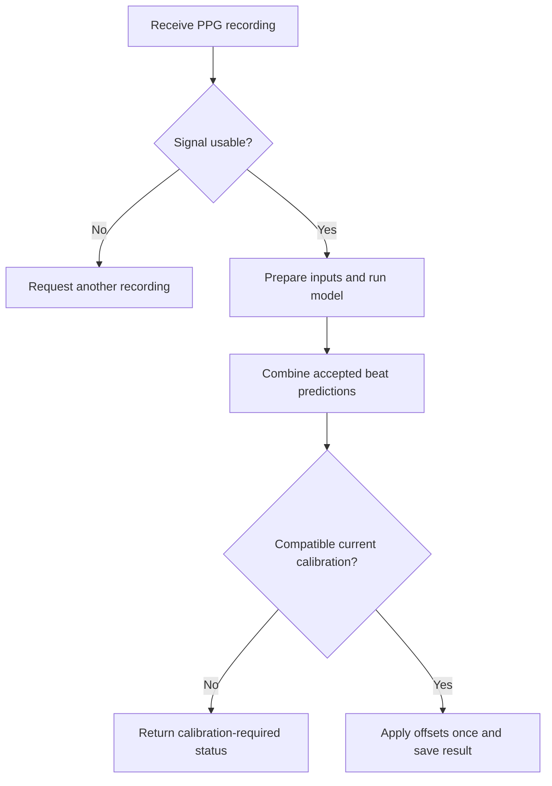

# Blood-pressure prediction: a plain-English team guide

Updated September 28, 2026. Covers **weighted/monthly calibration documentation** and **testing on-device inference with mock data**.

Reading guide: start with Sections 1–2 for the overview, Section 3 for calibration, Sections 4–7 for the phone tests, and Section 8 for research options. Section 9 maps the document to both assignments' acceptance criteria.

## 1. What we have accomplished

**The iPhone can run the original trained model locally, including preparing an artificial pulse recording before prediction.** Tests now include every detected beat in the original recording, shifted windows, five-minute fixed and rolling replay, a twenty-minute fixed-block replay, and a separate automated memory test.

**Calibration is documented and its calculation code exists.** The screens for collecting cuff readings, saving personal calibration profiles, and sending reminders still need integration. No experiment yet shows that a personal correction remains accurate for a month.

Rithika ran the physical iPhone and HiPerGator jobs and supplied their reports. The assistant prepared software/reference checks and reviewed those results; it did not remotely operate the phone. Successful software execution and accurate blood-pressure measurement are separate achievements. The first is demonstrated here; useful real-world BP accuracy remains unresolved.

| Assignment | Status supported by the evidence |
|---|---|
| Document the weighted/calibrated prediction approach | Covered by this guide: method, collection, storage, expiry, evaluation and implementation decisions |
| Test on-device BP inference with mock data | Completed for the documented physical-phone tests, with performance, memory and limitations recorded |
| Implement monthly calibration throughout the app | Pending beyond the calculation library |
| Validate actual wearable BP measurements | Pending: live sensor input, signal-quality rules and accuracy over time |

## 2. The words and files, explained

| Term | Meaning in this project |
|---|---|
| **PPG** | A light sensor measures changes associated with blood volume in tissue. The resulting pulse-shaped wave is a sequence of numbers. It is an input to the model, not a direct BP measurement. |
| **SBP / DBP** | The top and bottom BP numbers. For `120/80`, SBP is 120 and DBP is 80. Their unit is **mmHg**. |
| **Training** | Teaching a model using examples and reference BP values. This happened on HiPerGator. |
| **Inference** | Using the already-trained model to calculate an answer for a new input. This happens on the phone. |
| **`.pth` checkpoint** | A saved PyTorch model file containing learned numbers. It is used in the Python research/export workflow. |
| **ONNX (`.onnx`)** | A portable way to store a trained model's calculation and learned numbers. We converted the checkpoint into this format for the app. |
| **ONNX Runtime** | The software that executes the ONNX model. Our app uses its React Native package to run locally on iOS. [R1] |
| **Preprocessing / features** | Preparing the wave and calculating useful input measurements, such as its slopes and timing. |
| **Normalization** | Putting inputs on the numerical scale used during training, using saved averages and spreads. This is not personal calibration. |
| **Calibration** | Comparing a person's model estimates with paired reference cuff measurements, then calculating a personal correction. |
| **Edge computing** | Running the calculation near the source of the data. Here the tested edge device is the **iPhone**, not a watch or cloud server. |
| **Mock / synthetic data** | Artificial test inputs whose expected software outputs are known. They test the program, not someone's health. |
| **MAE** | Mean absolute error: the average size of prediction mistakes. Errors of 5, 10 and 5 give an MAE of `20/3 = 6.67 mmHg`. It does not bound every person's error. |
| **JSON report / hash** | JSON is a readable data file. A SHA-256 hash is a file fingerprint used to identify exact bytes; it does not certify accuracy. |

## 3. Calibration: what the proposed method actually does

### A personal correction, with an example

Suppose the model tends to predict too low for one person. We compare its **uncalibrated recording-level estimate** with a reference cuff measurement made under matched conditions. We do that for several accepted pairs and average the differences.

We calculate **two separate corrections**, one for SBP and one for DBP. A positive correction is added; a negative correction is subtracted. The initial approach does not retrain the model or fit a multiplier.

These numbers are fictional:

| Pair | Model estimate | Reference cuff | Cuff minus model |
|---|---:|---:|---:|
| 1 | 118 / 76 | 126 / 80 | +8 / +4 |
| 2 | 122 / 78 | 128 / 82 | +6 / +4 |
| Equal-weight average correction | | | **+7 / +4** |

For a later model estimate of `121/77`, the corrected result is:

```text
SBP: 121 + 7 = 128
DBP:  77 + 4 = 81
Result: 128/81 mmHg
```

If the correction were `−5/−3`, the same `121/77` would become `116/74`. Apply the correction once and round only for display.

This method assumes that some of the person's error is an approximately stable offset. It cannot repair a model that fails to follow changes in BP, poor sensor contact, or incorrectly prepared inputs. A cuff reading alone is insufficient: we need its appropriately paired model estimate to calculate the difference.

### What “weighted” means

A weight determines how much a value contributes to an average. There are two proposed uses:

1. **Within a recording:** combine predictions from accepted beats into one recording estimate.
2. **Within a calibration session:** combine the cuff-minus-model differences from distinct paired measurements into two corrections.

Start with **equal weights for accepted beats and equal weights for accepted cuff pairs**. Later, a validated signal-quality score could give clearer observations more influence. Such a quality score is not yet established. Closeness to a “normal” BP value must not define quality.

For example, differences of +8 and +6 average to +7. Giving them weights 0.75 and 0.25 produces `0.75×8 + 0.25×6 = +7.5`. This illustrates the arithmetic; these unequal weights are not a validated policy.

For developers, apply the following separately to SBP and DBP:

```text
recording_estimate = sum(beat_weight × beat_prediction) / sum(beat_weight)
personal_offset   = sum(pair_weight × (cuff − recording_estimate)) / sum(pair_weight)
corrected_result  = new_recording_estimate + personal_offset
```

Reject unusable beats/pairs first. Weights must be finite and nonnegative, with a positive total. A recording containing many beats paired with one cuff reading is still **one cuff observation**. Do not count it as dozens of independent reference readings.

The model's training-loss weights are another concept: they affect learning on HiPerGator. They do not automatically supply personal calibration weights or prediction confidence.

### How a monthly calibration session should work

This is a **proposed research workflow**, not an implemented or clinically validated app feature:

1. **Start a session for the correct person and sensor.** Record which model and processing version are being used.
2. **Prepare the reference measurement.** Use a validated upper-arm cuff with the correct size. Rest quietly for at least five minutes; sit with back supported, feet flat and arm supported at heart level. Avoid smoking, caffeine and exercise during the preceding 30 minutes; empty the bladder. Take two cuff readings one minute apart and record both. These are reference-measurement basics from the AHA, not proof that two readings sufficiently calibrate our model. [R2]
3. **Pair each cuff measurement with a suitable PPG recording.** Each pair needs timestamps and an uncalibrated model estimate under comparable conditions. Do not pair last week's cuff value with today's pulse. The team must validate the timing, sensor site and handling of cuff inflation; PPG disturbed by an inflating cuff must not be accepted as an ordinary resting recording.
4. **Check the pairs.** Reject unusable signal, invalid numbers, duplicates or recordings outside the declared pairing/session limits. The current calculation core requires at least two distinct accepted, positively weighted pairs. This is a software minimum, not evidence that two pairs are sufficient for dependable BP estimates.
5. **Calculate and save the two offsets.** Use the newest accepted session. Keep the cuff readings and original model estimates so the calculation can be explained later.
6. **Set the next due date.** Proposed research policy: expire after **30 days**, measured from the calibration measurements, and offer a reminder. A late upload must not restart the 30-day clock.

**How often?** Monthly is the requested product policy; the current evidence does not establish a scientifically valid interval. Recalibration stability requires measurements over time. ESH recommendations specifically include testing stability after calibration. [R3] A changed model, sensor placement or processing pipeline can also invalidate a profile before its due date.

Use the latest accepted session initially. Do not arbitrarily mix old months together, blend “70% model + 30% last month's cuff,” or gradually reduce an expired correction toward zero. Those would be different methods needing their own evaluation.

### What must be stored

A **calibration profile** is the saved record of a calibration session. Proposed storage should support authenticated user separation and protected local access for offline operation. Optional cloud synchronization can follow the app's chosen backend design; it is not implemented by merely saving JSON.

| Stored information | Why it is needed |
|---|---|
| User, profile/session ID and revision | Apply the correct person's profile; trace changes |
| SBP and DBP offsets, in mmHg | The two corrections used by predictions |
| Original cuff values and uncalibrated recording estimates | Reproduce the calculation and investigate bad entries |
| Pair IDs, timestamps, acceptance/rejection reasons and weights | Prevent duplicates and explain which observations contributed |
| Measurement time, creation time and expiry time | Distinguish an old measurement from a newly uploaded one; use UTC internally |
| Exact model and normalization fingerprints | Prevent using offsets fitted to a different model or input scale |
| Processing, signal-quality and pairing-protocol versions | Changes to the method can change the required correction |
| Sensor ID, firmware, body site, channels, sampling/resampling configuration | Check whether the measurement setup still matches |
| Superseded-profile ID and activation state | Replace a profile without changing the meaning of older results |

Activate a completed profile atomically: other predictions should see either the previous valid profile or the new complete one, never a partially written update. Keep each historical result linked to the profile actually used. Synthetic tests must not create personal profiles or health-journal entries.

### Inputs, outputs and the prediction flow

**Required inputs:** a usable PPG recording with timestamps and sampling information; the matching model and saved normalization; user/sensor context; and, for a corrected result, an active compatible profile. Creating that profile additionally requires paired reference cuff values.

**Required outputs:** the uncalibrated recording estimate, corrected SBP/DBP when available, units, measurement time, calibration status/reason, profile ID, model/processing identifiers and signal-quality status. Preserve unrounded numbers internally. Do not invent a confidence percentage from the quality weights.

The proposed production flow is:



The sensor-quality gate, personal calibration collection/storage and resulting user-facing workflow remain integration work. Today's test screens execute synthetic software checks and diagnostic window summaries.

| Situation | Recommended behavior |
|---|---|
| No calibration, or fewer than two accepted pairs | Request calibration; do not label an uncalibrated result as calibrated |
| Expired profile | Return a stale/calibration-required status; retain history without silently reusing the correction |
| New user or incompatible model/sensor/processing context | Do not apply that profile; require a compatible calibration |
| No usable beats or zero total weight | Return insufficient signal, with no fabricated BP estimate |
| Incorrect units, nonfinite values, SBP not greater than DBP, or impossible timestamps | Reject the input and explain the reason |
| Highly inconsistent reference readings or an unusually large correction | Request review/recollection using a predefined protocol; thresholds still need validation |
| Duplicate cuff pair, or calibration data reused as a future test | Reject the reuse; these are not independent observations |
| Two conflicting latest profiles or an incomplete save | Resolve the conflict; do not select one arbitrarily |
| Result already corrected | Do not apply offsets again |
| App offline | Use a locally stored valid compatible profile; being offline does not extend expiry |
| Model outputs become invalid after correction | Return an explicit failure; do not silently clamp to a plausible BP |

An uncalibrated output may remain available in a clearly labeled research report. It should not masquerade as a validated personal measurement when calibration is unavailable.

### How we evaluate calibration honestly

Use some paired measurements to calculate the correction and **different, later measurements** to test it. Otherwise we are testing on the answers we just used to adjust the model.

Compare at least: the uncalibrated model, the corrected model, and simply predicting the person's calibration-reference average. Report errors by person and over time, including a proposed schedule such as days 0, 7, 14 and 30. Day-0 evaluation still needs separate pairs. Report rejected recordings and coverage as well as error: rejecting difficult cases can make an average error look better.

Our original saved-model audit illustrates why the reference-only comparison matters:

| Existing offline test | SBP MAE | DBP MAE |
|---|---:|---:|
| Original model, uncalibrated | 14.3402 | 9.5348 |
| Original model with five-reference correction; reference beats excluded | 10.2240 | 5.8038 |
| Simply use the average of those five references | 10.2298 | 5.8188 |

The corrected model barely improved on the reference average. Its correction does not yet demonstrate useful tracking of BP changes. These five references were dataset arterial-pressure beat labels, **not five home cuff visits**, and their cached order does not establish a chronological month-long study.

The standalone implementation is `services/bp-calibration-research/bpCalibration.js`, with TypeScript declarations. Its arithmetic, state and installer checks passed 21 local test groups. Core operations include aggregating predictions, creating/selecting a profile, applying it and serializing it. **Collection UI, secure persistence, reminders and full mobile calibration testing remain pending.** Serialization alone provides neither encryption nor authentication.

Open decisions: cuff/PPG pairing timing and site; signal-quality rules; minimum reliable reference count; repeatability/offset limits; validated expiry interval; storage/sync conflict policy; and what real-world accuracy is required before displaying estimates to users.

## 4. Which model is actually on the phone?

The tested package uses the **original cBP-Tnet checkpoint**, converted to ONNX. The later research candidates have not replaced it in the supplied device evidence.

| Repository path, relative to `cddapp` | Role |
|---|---|
| `python code/cBP-Tnet_Model.pth` | Original learned model used for export; 20,925,411 bytes |
| `assets/models/onnx_export/cbp_tnet.onnx` | Model the iPhone actually loads; 20,979,327 bytes, about 21 MB |
| `assets/models/onnx_export/normalization.json` | Saved training input scales and channel/timing order |
| `assets/models/onnx_export/export_report.json` | Export identities and numerical conversion checks |
| `assets/models/onnx_export/synthetic_model_smoke_test.json` | Prepared artificial input and expected output for the initial quick test |
| `assets/ppg-expanded/full_ppg_reference_v1.json` | Artificial raw-wave reference for the expanded tests |
| `services/bpPpgPreprocess.js` | JavaScript preparation of the PPG wave |
| `services/bpPpgChainOrt.js` | Adapter connecting prepared inputs to ONNX Runtime |
| `services/bpExpandedCore.js` and `app/ml-ppg-expanded.tsx` | Full-window/replay test logic and screen |

The first three file fingerprints were verified in a fetched `rithika-ML` checkout at commit `2bd3424767acb67aece47fa2fddb7cfcd21b4fae`. This identifies the demonstrated original model; it does not make it the best BP model. Expanded test files were installed separately in the local app workflow. Their publication to GitHub must be checked at handoff; this document does not claim a new push.

Replacing a `.pth` file does **not** update the ONNX file already bundled inside an installed app. A new research model requires its matching preprocessing, input/output scaling, export, reference checks, rebuild and device tests.

## 5. Why a continuous signal fits on a phone—and why tests are fast

The model is a fixed set of learned numbers and operations. Receiving another minute of PPG does not increase its size. Our replay keeps a limited input buffer of **3,750 samples**, representing 30 seconds at **125 samples per second**.

Each inference call uses one prepared beat: three arrays of 250 values plus two timing values. The arrays describe PPG, its slope and the change in that slope. These are calculated channels, not three LED colors or accelerometer axes. Short beats are padded to 250 values; this does not mean every beat lasts two seconds. The two timing slots are legacy shape/interval inputs, not a direct measurement of pulse transit time between two body sites.

The input numbers occupy about **3 KB per call** before software overhead. The roughly 21 MB model and temporary working memory are additional. Stored model size, working memory and raw-signal storage are different quantities.

**Collecting 30 seconds of fresh PPG takes 30 seconds. Calculating from samples already in a file can take a fraction of a second.** The phone uses trained weights; it does not repeat HiPerGator training. The long replay tests deliberately waited for sample arrivals, which is why a twenty-minute replay really took approximately twenty minutes.

| Schedule already exercised with synthetic replay | Meaning |
|---|---|
| Fixed blocks | Process seconds 0–30, then 30–60, then 60–90 |
| Rolling windows | Process 0–30, then 5–35, then 10–40; give a new update every five seconds after the first 30 seconds |

The current implementation reprocesses each complete window and resets the legacy filter. It does not yet continuously carry filter state across a live wearable stream. Overlapping windows reuse beats; their results must not be pooled as independent measurements. Per-window means and medians currently serve as software diagnostics, without personal calibration or a validated quality policy.

## 6. What the physical iPhone tests demonstrated

### Device, inputs and pass criteria

Reported hardware: **iPhone 16 Pro**, hardware identifier `iPhone17,1`, **iOS 26.6.2**. The measured app used a **Release/non-development build**, Hermes JavaScript, **ONNX Runtime React Native 1.24.3**, CPU execution and one thread. No cloud model inference or watch execution is shown by these reports.

Two kinds of mock input were used: an already-normalized artificial beat, then a generated 30-second raw PPG signal with 3,750 samples. Python generated expected prepared features, normalized inputs and model outputs ahead of time. The app calculated its own outputs and compared them with those references.

The quick test produced about **109.3460 / 53.5788** on the phone, matching its Python reference within **0.000031 / 0.000004 mmHg**. These numbers describe a test fixture, not Rithika's BP.

The expanded reference contains the original signal and five shifted windows. The original has 31 candidate beats; the six windows contain 189 candidates altogether. **All 31 original candidates now go through the full calculation.** The earlier first-four-only restriction no longer describes the expanded test.

Check expected candidate counts/intervals, numerical feature and normalization agreement, finite model outputs in SBP/DBP order, runtime errors and cleanup. The phone-versus-Python output tolerance is **0.01 mmHg per output**. This is a software agreement tolerance, not the model's BP accuracy.

### Recorded results

| Test supplied and reviewed | Completed windows | Successful model calls | Observation |
|---|---:|---:|---|
| All beats: original plus five shifted windows | 6 | 189 / 189 | Passed; total approximately 1.075 seconds |
| Five-minute fixed-block replay | 10 | 310 / 310 | Passed |
| Five-minute rolling-window replay | 55 | 1,732 / 1,732 | Passed |
| Twenty-minute fixed-block replay | 40 | 1,240 / 1,240 | Passed |
| Five-minute idle control | 0 | 0, intentionally | Buffering/pacing completed; no inference was attempted |

The four inference runs total **3,471 successful calls across 111 windows**, with zero reported Python-comparison failures or run/cleanup errors. Their sessions were released. They reuse an artificial waveform; they are not thousands of independent patient observations.

The largest reported phone-versus-Python differences were **0.00002289 mmHg SBP** and **0.00001144 mmHg DBP**. Every window reported zero feature/timing/normalization differences. The full test's 189 output pairs were also recalculated during report review. The longer replay reports contain summaries; their omitted individual arrays were not independently recalculated.

Average complete-window processing was approximately **156–196 ms**, with a slowest reported window of **216.13 ms**. This includes preparation and reference checks; model-session setup is separate. Replay buffer length stayed at or below 3,750 samples. No sample-arrival delay crossed the code's one-second deadline threshold; that does not mean timing was perfectly uniform.

Three earlier inference-profiling runs each completed 111 calls: one first call, ten warm-ups and 100 measured calls. Their measured mean call times were **6.187, 9.713 and 6.436 ms**, with corresponding 95th-percentile times **7.742, 12.386 and 7.376 ms**. A 95th percentile means 95% of measured calls were at or below that time. These are separate measurements from complete-window timing, not contradictory estimates of the same workload.

### Memory observations

The separate automated test ran five create/run/release cycles, totaling **555 successful calls**. It took **1,251 native memory samples**, roughly one every 50 ms, with zero sampling failures.

| Whole-app physical memory measurement | Decimal MB |
|---|---:|
| Baseline median | 35.1 |
| Highest observed sample | 72.1 |
| Settled after the first cycle | 70.7 |
| Settled after the fifth cycle | 50.2 |

Memory includes the whole app, runtime, measurement recorder and retained reports. It is not “72 MB used by the model alone.” Sampling can miss a brief peak. Retained memory can include reusable allocations; this short run establishes neither a memory leak nor proof that leaks are absent. Memory was not measured during the twenty-minute replay.

### Failures resolved, and limits still present

Early development builds could not reach the Mac's development server, and the Expo command encountered a Simulator lookup error. The later tests used the installed physical-device Release app; the existing Xcode workspace provided a build route. These setup problems are separate from the successful supplied inference runs.

Still unmeasured or unvalidated: actual sensor/Bluetooth acquisition, motion and missing packets, dependable signal-quality rejection, true cold app-start time, energy/battery use, all-day operation, and personal calibration integrated with real readings. The idle run contains **no energy measurement**. The twenty-minute test was synthetic foreground replay, not continuous acquisition from a person.

The synthetic fixture is representative of the **software input format and processing path**, not the full range of people, pulse shapes or sensor conditions. Matching Python does not establish that Python predicts BP accurately.

## 7. Reproducing the device tests

Use the tested local project with the expanded test files, bundled references and custom native memory module present. Do not assume an older GitHub checkout contains every later addition.

1. On the Mac, open the existing CocoaPods workspace:

   ```bash
   cd /Users/rithika/Desktop/cddapp
   open -a Xcode ios/cddapp.xcworkspace
   ```

2. Select the `cddapp` scheme and physical iPhone. In **Product → Scheme → Edit Scheme → Run → Info**, select **Release**. Build and run with the project's signing configured. Installing a new build needs a connected device through USB or an already configured wireless development connection. An installed Release app with these bundled assets can run without USB or the development server.
3. In the app, open **Test ML model**. Run **Run synthetic test** to check the original prepared input. Use **Profile synthetic inference** for the repeated timing report.
4. Open **Test all beats and timed replay**. Tap **1. Run all beats + window comparison**. Expect 189 successful calls and no output mismatches.
5. Set replay duration to five minutes. Run **2. Replay fixed blocks** and **3. Replay rolling windows** separately. Expected counts are 310 and 1,732 calls. Keep the screen open and phone awake; leaving/locking cancels this test.
6. Set duration to twenty minutes and run fixed blocks. Expect 1,240 successful calls. Use **Share report** after each run and retain the JSON. The idle option deliberately makes zero model calls.
7. For memory, close and reopen the app first. Open the memory-test screen and tap **Run automated memory test**. Let its five cycles and ten-second settling waits finish. Save **Share summary JSON** and, when needed, **Share full trace JSON**. The baseline is fresh for this measurement, not a certified cold-start measurement.
8. Record phone/iOS/app version, Release status, model/reference fingerprints, test mode, counts, errors, timing and whether the phone was charging. Preserve failed/cancelled reports too. Treat different models or instrumented runs as different benchmark conditions.

Future test additions should cover invalid inputs, poor contact, motion, missing samples, background interruptions and real sensor timing. Battery and cold-start measurements need dedicated procedures, not an inference timer relabeled as those metrics.

## 8. Can another model or feature-extraction method lower the errors?

**Possibly, yes. Our results do not establish an accuracy ceiling.** They show that four architectures performed similarly with this particular shared input representation and training recipe.

All 12 declared runs completed: four models, each using three random training seeds. The following are validation-development averages in mmHg; the ± number measures variation across seeds, not uncertainty across patients.

| Model | SBP MAE, mean ± seed SD | DBP MAE, mean ± seed SD |
|---|---:|---:|
| Small CNN | 13.0435 ± 0.0444 | 8.6337 ± 0.0226 |
| cBP-Tnet | 12.9911 ± 0.0997 | 8.6854 ± 0.0478 |
| XResNet1D-50 adaptation | 12.9929 ± 0.0328 | 8.7328 ± 0.0322 |
| Inception1D adaptation | 13.0140 ± 0.0142 | 8.7162 ± 0.0355 |

The two external backbones were adapted to our padded single-beat inputs, not used to reproduce their complete published longer-window experiments. These results neither establish statistical equivalence nor rule out gains from other training settings. The small CNN is a practical development baseline: 464,962 parameters versus Tnet's 5,219,394, with similar observed errors. That size difference does not by itself prove a phone speed or battery advantage.

### Research directions we have not yet fairly tested here

| Direction | Plain-English explanation and proposed test | Evidence and caution |
|---|---|---|
| **Better pulse landmarks and shape features** | Locate the start and top of a pulse, then measure rise time, widths, areas and derivative shapes. Compare those features with the current representation. | The peer-reviewed **pyPPG** toolbox validates landmark detection and defines 74 PPG biomarkers. It supplies an evaluated feature-extraction starting point, not a guarantee of better BP accuracy. [R4] |
| **Feature-based BP prediction** | Give a smaller regression model explicit pulse measurements, rather than expecting a neural network to learn everything from raw arrays. Compare a tree-based model such as LightGBM with the CNN under the same split. | The **BP Benchmark** authors publish segmentation, cleaning and feature-extraction code, including timing, shape and frequency features. LightGBM is a proposed project arm here; it has not been run in the supplied comparison. [R5] |
| **Learning from longer recordings** | Train on a window containing several beats, instead of one padded beat. This can expose variation across a recording. | Our phone replay still invokes a single-beat model repeatedly; it is not a model trained to jointly understand a whole window. The author's longer-window XResNet/Inception workflow is another experiment to reproduce, with matched labels. [R6] |
| **Pretrained PPG representations** | Start with a model already taught general pulse patterns, then train a BP prediction layer. | **AnyPPG** provides a pretrained encoder and a 125 Hz, 10-second loading example. It outputs learned features, not a ready-to-use personal BP reading. Its paper includes BP experiments. Pretraining includes PulseDB/MIMIC sources, so patient overlap with our evaluation data must be checked before making an unseen-patient claim. [R7, R8] |

Published MAEs cannot be pasted into our comparison as if they used the same patients, references, exclusions and calibration budget. “SOTA” means state of the art under a specified evaluation; it is not a guarantee that a named architecture will win on this project.

### Recommended next experiment

**First investigate the input and label definitions, then compare feature-based and longer-window models.** This is a prioritization judgment, not proof that preprocessing is the sole cause of the errors.

The source audit found that the old rise-time proxy is measured inside peak-to-peak segments, so its maximum commonly sits at an endpoint. Changing a smoothing filter alone did not repair that definition. The latest four-model benchmark masks that problematic scalar, so fixing it cannot be assumed to explain all remaining error. ABP labels are also selected from a longer window that can include other beats; physiologically appropriate PPG/ABP alignment needs investigation. Simply taking matching array indices is not automatically a correction.

Use stable patient/recording/beat identifiers, preserve the old caches, and change declared factors systematically. Fit normalization only on training data. Compare alternatives on the same independently defined reference task; do not claim improvement merely because a new label rule made the target easier. Report rejected-data coverage, BP ranges, per-person errors and prediction variation, not MAE alone.

Causal filters, which only use available past/current samples, and offline filters that use future samples must be evaluated according to the intended deployment. The filter audit tested execution and waveform diagnostics, not BP accuracy. A visually smoother signal is not automatically a more informative one.

The historic cache-to-patient mapping remains reconstructed rather than independently certified. Earlier project work has already examined the existing test split. A final accuracy claim therefore needs a clearly documented evaluation history and an appropriately reserved evaluation set or external cohort. No additional model training, phone replacement or GitHub push was performed while preparing this guide.

## 9. Handoff checklist

| Acceptance criterion | Where it is covered |
|---|---|
| Explain weighted/calibrated method and rationale | Section 3: separate offsets, worked example, two weighting stages and assumptions |
| Define monthly collection, storage and application | Section 3: session steps, profile fields, proposed 30-day policy and prediction flow |
| Specify inputs, outputs and edge cases | Section 3: required data and failure/state table |
| Explain effects on evaluation | Section 3: separate reference/evaluation pairs, reference-only baseline and longitudinal tests |
| Provide implementation recommendation and open questions | Section 3: existing core, pending integration and unresolved protocol choices |
| Identify repository model and on-device path | Sections 4–5 and fingerprints below |
| Prepare mock inputs and expected checks | Section 6: synthetic fixtures, Python references and tolerance |
| Run and record a physical-device test | Section 6: user-run device identity, counts and outcomes |
| Capture performance, memory, failures and limitations | Section 6: timings, sampled memory, setup issues and unmeasured items |
| Document reproduction and follow-ups | Sections 7–8 |

The documentation and mock-inference tickets can be handed off with the evidence described here. The next implementation work is calibration collection/storage and real sensor integration; the next research work is input/label quality and controlled accuracy comparisons. Neither ticket's completion establishes a validated medical BP monitor.

## Appendix: identifiers and evidence

These are the original tested model-package fingerprints. The checkpoint and ONNX hashes differ because they are different files; the export process establishes their relationship.

```text
Original PyTorch checkpoint:
2cabfe0c64bf2463495d9581dea837638c41c149948abd9730b8b6be25fd0169

Phone ONNX model:
a8e26e25b852344814e4a474e73e92b9f8d40845c20948fdcce828c9e4f12fce

Saved normalization:
bc8a28b7ca84faa00644fa7d13ae706705ecd47b9543296753273555be3aba41

Full synthetic-window reference:
88e4ad195fe39cfdaebfa8f7c2cb7b76d0d29b9fd3fa63f61c7d3eae81d0117e
```

Evidence companions:

- `CDD_Blood_Pressure_Engineering_Status_and_Calibration.md`: detailed audit and development history; later dated updates supersede earlier pending statuses.
- `Expanded_iPhone_Test_Results.md` and `cdd-expanded-results-20260927.zip`: supplied device reports, preserved evidence and arithmetic review. The completed expanded runs were recorded September 25 and reviewed September 27.
- `Published_Model_Comparison_Results.md` and `cdd-benchmark-results.zip`: the completed 12-run summary, explicitly transcribed console values and independently recomputed averages. Full per-run training reports/checkpoints were not independently retrieved for this guide.
- HiPerGator benchmark directory: `/orange/xiangyan/rithika/cdd/outputs/iphone_inference/published_model_benchmark_20260928T003408542282Z`.
- Earlier supplied reports: `cdd_five_cycle_memory`, `cdd_raw_ppg_preprocessing`, `cdd_raw_ppg_chain` and synthetic inference profiles. These document earlier stages and should not be confused with the expanded all-beat tests.

## References

Research and guidance checked September 28, 2026. These sources support the methods or recommendations described; none independently validates this app.

- **[R1]** Microsoft, [ONNX Runtime mobile deployment documentation](https://onnxruntime.ai/docs/tutorials/mobile/).
- **[R2]** American Heart Association, [Home Blood Pressure Monitoring](https://www.heart.org/en/health-topics/high-blood-pressure/understanding-blood-pressure-readings/monitoring-your-blood-pressure-at-home), reviewed August 2025. Reference-cuff technique, not a monthly calibration protocol for this model.
- **[R3]** Stergiou and colleagues, [European Society of Hypertension recommendations for validation of cuffless BP devices](https://pubmed.ncbi.nlm.nih.gov/37303198/), 2023; [DOI](https://doi.org/10.1097/HJH.0000000000003483). Includes calibration-stability evaluation.
- **[R4]** Goda, Charlton and Behar, [pyPPG: a Python toolbox for comprehensive photoplethysmography signal analysis](https://www.repository.cam.ac.uk/items/190dedd6-87c7-47c5-8f59-dd3b4421fad9), *Physiological Measurement*, 2024; [DOI](https://doi.org/10.1088/1361-6579/ad33a2).
- **[R5]** González and colleagues, [A benchmark for machine-learning based non-invasive blood pressure estimation using photoplethysmogram: author code and feature guide](https://github.com/inventec-ai-center/bp-benchmark).
- **[R6]** [Generalizable deep learning for photoplethysmography-based blood pressure estimation — A Benchmarking Study](https://arxiv.org/html/2502.19167v2) and [author implementation](https://github.com/AI4HealthUOL/ppg-ood-generalization). Our completed four-model run adapts backbones from the pinned source; it is not a full paper reproduction.
- **[R7]** Nie and colleagues, [AnyPPG research manuscript, version 3](https://arxiv.org/html/2511.01747v3), March 2026.
- **[R8]** [AnyPPG author repository and pretrained-encoder instructions](https://github.com/PKUDigitalHealth/AnyPPG).
